# How to demo AMA tools for JAX-RPC

The following guide should help to do a simple end-to-end tutorial.
Main steps:
1. Test the JAX-RPC client calling the JAX-RPC service both running as separate applications in traditional WAS.
2. Analyze the applications using Application Modernization Accelerator (AMA) to identify issues when migrating to Liberty
3. Use the Application Modernization Accelerator Development Tools to convert the tWAS JAX-RPC service to JAX-WS on Liberty
4. Test the modernized JAX-WS service running on Liberty with the existing JAX-RPC client running on Liberty.
5. Optional: Use the Application Modernization Accelerator Development Tools to convert the JAX-RPC client to JAX-WS on Liberty
6. Test the modernized JAX-WS service with the modernized JAX-WS client both running on separate Liberty instances.

It is based on the TechZone environment:
https://techzone.ibm.com/my/reservations/create/6920edc50768fd50bcad6e74 

## Introduction

WebSphere Application Server Liberty does not support JAX-RPC services or clients. However, the Liberty JAX-RPC conversion tool can convert JAX-RPC applications to JAX-WS applications that can run on Liberty. 
https://www.ibm.com/support/pages/websphere-liberty-jax-rpc-conversion-tool-maven-and-gradle 
Unfortunately the tool could only act on the application binaries. A new functionality within **Application Modernization Accelerator Development Tools** now allows to automate the conversion in the source code. The tutorial will show how to do it

In this tutorial, you will use an existing JAX-RPC application running on traditional WebSphere Application Server. The applicaton consists of a client and a service component, both installed on different WAS servers within the same WAS ND cell. 
First you will test the application as is, then you will analyze it for mdernizatrion target Liberty using the Application Modernization Accelerator (AMA).  Then you will use the AMA Dev Tool automation to modernize the service from JAX-RPC to JAX-WS so that it can run on Liberty. 

## Preparation:

### Reserve an environment in Techzone
Please request the following RHEL environment in TechZone.
https://techzone.ibm.com/my/reservations/create/6920edc50768fd50bcad6e74
When the environment is provisioned and ready, open the TZ env reservation tile, and select the noVNC published service link in the reservation details page. 
The NoZNC password is: IBMDem0s!

Comment:
The environment has the following software installed:

- Application Modernization Accelerator 4.5 
- Application Modernization Accelerator Development Tools 4.5
- WAS ND 9.0.5 cell with Deployment Manager and two standalone servers server1 and server2
- The JAX-RPC application deployed on server1

### Clone the project

1. Open a Terminal window.

2. Create a working directory and download the project

		mkdir -p ~/Student
		git clone https://github.com/LarsBesselmann/JAX-RPC_Demo ~/Student
		cd  /home/techzone/Student/demo-rpc-ws-project
		chmod 777 /home/techzone/Student/demo-rpc-ws-project/scripts/*.sh

3. As the AMA Dev Tools wizard was already executed before, you need to remove those details from the user data.

		mv ~/.ibm_ama_devtools/vscode/e2ea3656-43fe-3fee-8497-2c2da57e9b23/ ~/.ibm_ama_devtools/vscode/e2ea3656-43fe-3fee-8497-2c2da57e9b23.sav

		mv ~/.ibm_java_app_mod/e2ea3656-43fe-3fee-8497-2c2da57e9b23 ~/.ibm_java_app_mod/e2ea3656-43fe-3fee-8497-2c2da57e9b23.sav

	If you do not complete those steps, the "Modernize to Liberty" wizard will start with the last resutls.

### Prepare the environment

1. Start the WAS ND Deployment Manager and the two node agents
	
		~/Student/demo-rpc-ws-project/scripts/startWASEnv.sh

	Alternatively you could also start the components separately

		~/IBM/WebSphere/AppServer/profiles/Dmgr01/bin/startManager.sh
		~/IBM/WebSphere/AppServer/profiles/AppSrv01/bin/startNode.sh 
		~/IBM/WebSphere/AppServer/profiles/AppSrv02/bin/startNode.sh 

2. Adjust the JAX-RPC service deployment (map it to server1)

		~/IBM/WebSphere/AppServer/profiles/Dmgr01/bin/wsadmin.sh -lang jython -f ~/Student/demo-rpc-ws-project/scripts/adjust_JAXRPC_service_deployment.py

3. Adjust the JAX-RPC client deployment (map it to server2 and change the context root from "/" to "/DemoRPCClient")

		~/IBM/WebSphere/AppServer/profiles/Dmgr01/bin/wsadmin.sh -lang jython -f ~/Student/demo-rpc-ws-project/scripts/adjust_JAXRPC_client_deployment.py

4. Access the Deployment Manager Administration Console via the URL https://localhost:9043/ibm/console to review the environment. 

- Credentials: techzone / IBMDem0s!
- server1 listens on HTTP port 9080
- server2 listens on HTTP port 9082

 

### Prepare the application assessment

#### Start the Application Modernization Accelerator 
To start the Application Modernization Accelerator, run the following commands

	cd ~/application-modernization-accelerator-local-4.5.0/
	./launch.sh 5

You should get an output like:  
**The Application Modernization Accelerator 4.5.0 is available for use at the following URL> https://rhel9-base.gym.lan:3001**

Access AMA via browser using the URL https://rhel9-base.gym.lan:3001.

<kbd>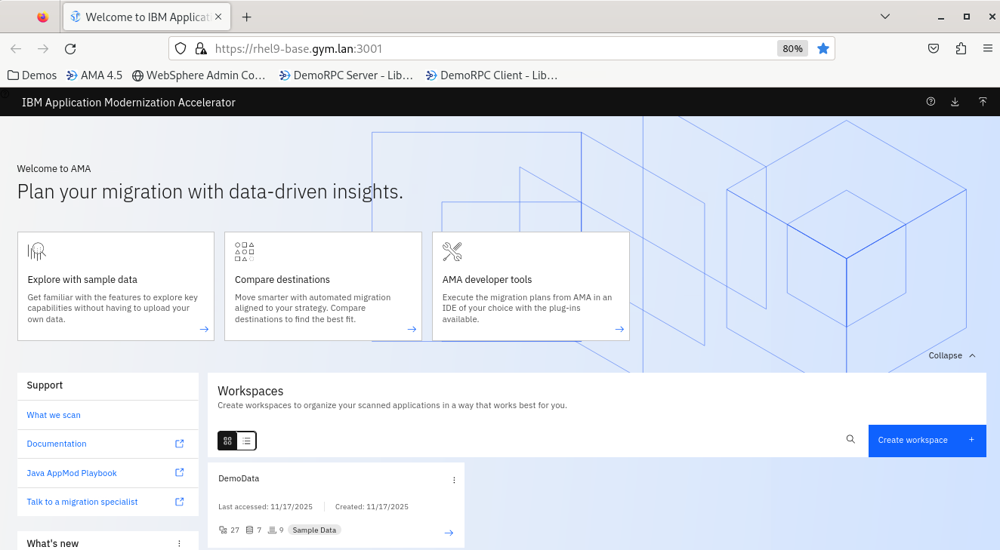</kbd>

#### Create a workspace, then download and run the discovery tool

1. In AMA, create a new workspace called **JAX_RPC**.

	<kbd>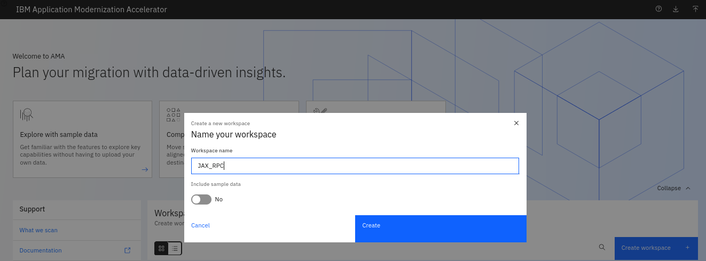</kbd>

2. Download the discovery tool.

	Click on **Open discovery tool** 
	
	<kbd>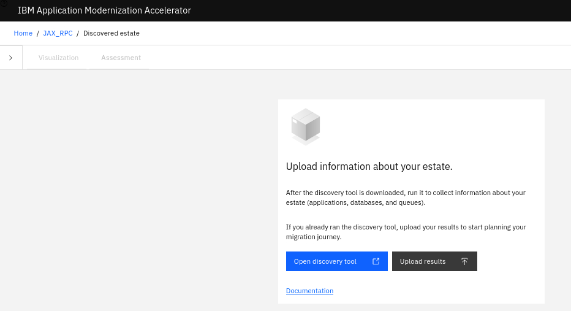</kbd>

	Leave the Source Operating System as Linux and click on **Download discovery tool** to download the discovery tool.

	<kbd>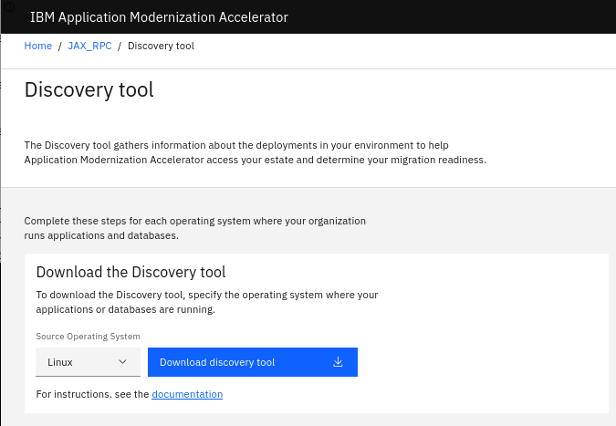</kbd>

	The file will be stored under  **~Downloads**

3. Extract the AMA Discovery Tool

	In a terminal window, execute the following commands:

		mkdir ~/Student/ama_discovery
		cd ~/Student/ama_discovery/
		tar -zxvf ~/Downloads/DiscoveryTool-Linux_JAX_RPC.tgz 

4. Run the discovery tool: 

		cd ama-discovery-4.5.0
		bin/ama-discovery -w ~/IBM/WebSphere/AppServer/

	Wait until you see a message indicating that the discovery has completed and the collection has been uploaded.
	<kbd>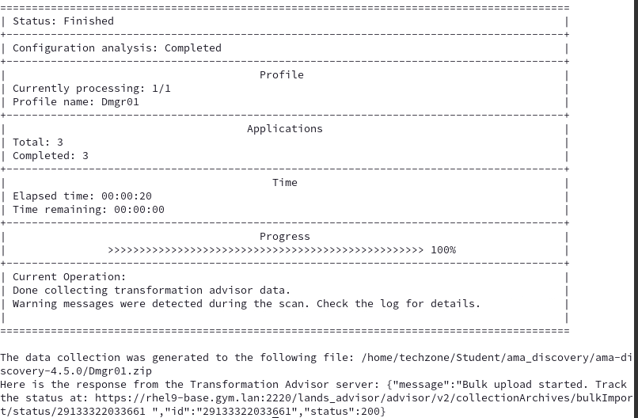</kbd>

5. Switch back to theh browser with the AMA (https://rhel9-base.gym.lan:3001). You should see a panel like this:

	<kbd>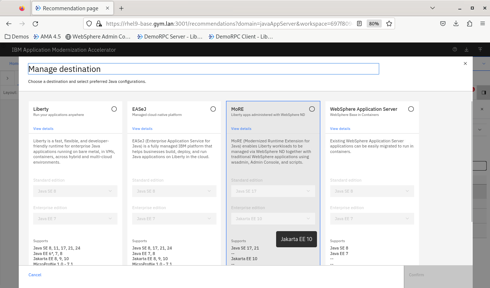</kbd>

	Select the **radio button** next to Liberty and click **Confirm**
	<kbd>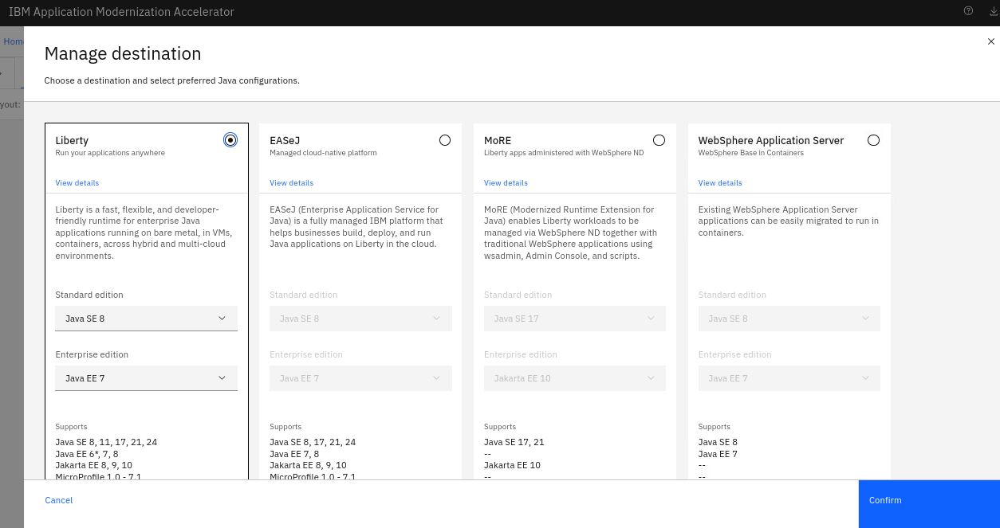</kbd>

6. In the Visualzation Panel, you can see the three discovered applications. 
	<kbd>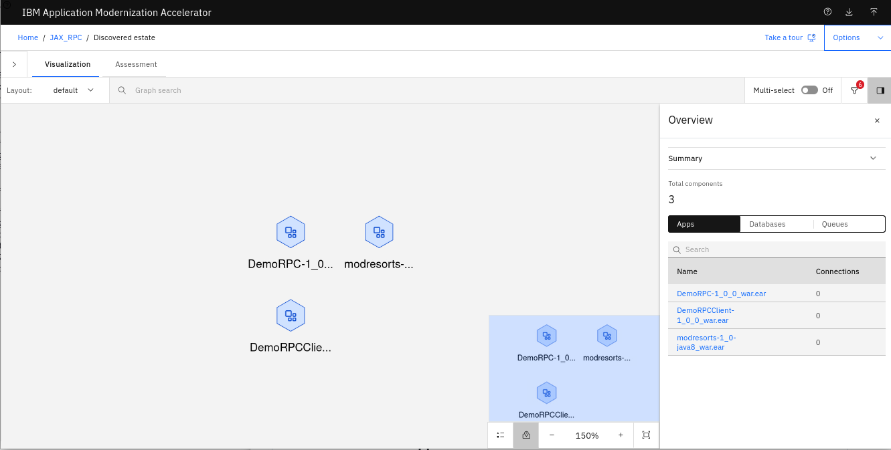</kbd>

Leave the browser open as you will use it later in the demo.

 

## Start the demo

### Test the JAX-RPC application on traditional WAS

1. Start the tWAS servers server1 and server2

		~/IBM/WebSphere/AppServer/profiles/AppSrv01/bin/startServer.sh server1
		~/IBM/WebSphere/AppServer/profiles/AppSrv02/bin/startServer.sh server2

2. Access the JAX-RPC service via server1 at URL: http://localhost:9080/DemoRPC/services/DemoRPC

	<kbd>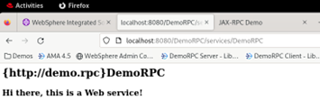</kbd>

2. Access the JAX-RPC client via server1 at URL: http://localhost:9082/DemoRPCClient

	<kbd>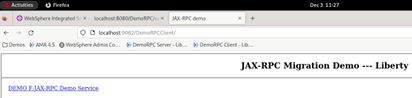</kbd>

3. Click on the link to access the servlet page **Personal Info Web Service**

	<kbd>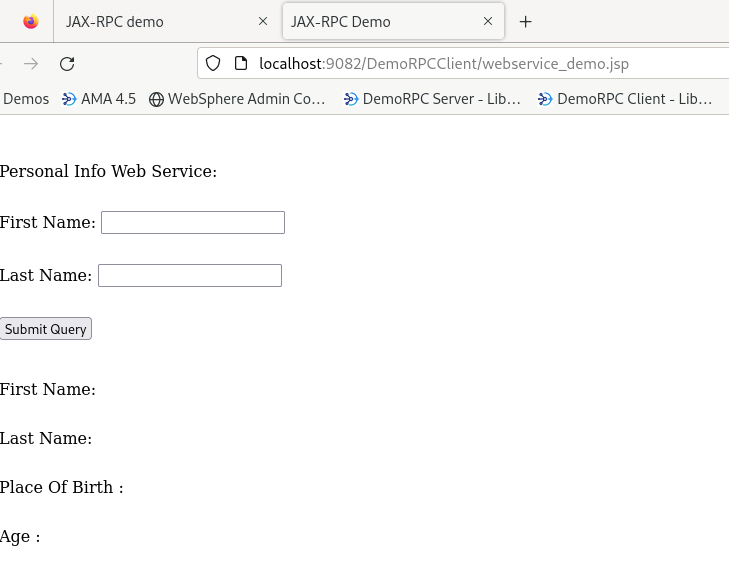</kbd>

4. Enter Jane Doe for the name, then click on **Submit Query** 

	<kbd></kbd>

	You should get the age and place of birth as response from the JAX-RPC service. 

	<kbd>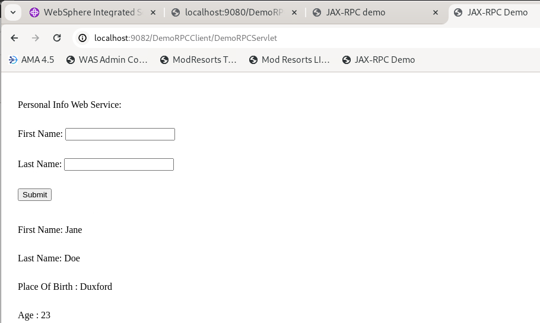</kbd>

### Assess the JAX-RPC service application

1. Access the Application Modernization Accelerator via browser using the URL https://rhel9-base.gym.lan:3001.

2. Explain the Visualzation Panel, where you can see the three discovered applications. 
	<kbd></kbd>

3. Click on **Assessment** to switch to the assessment panel.
	<kbd>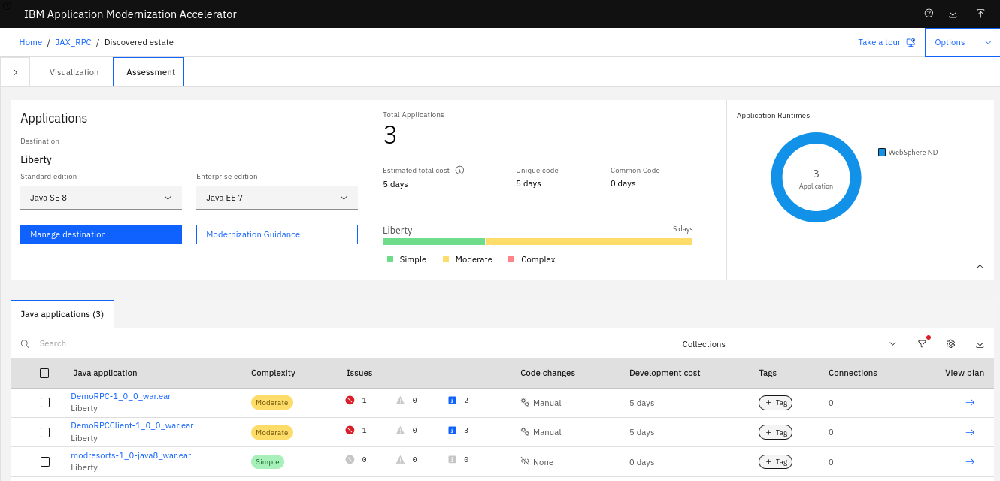</kbd>

	Hint: AMA 4.5 does not show AUTOMATED for the DemoRPC applications. 

4. Click on **DemoRPC-1_0_0_war.ear** to see the issues for the JAX-RPC service application.
	<kbd>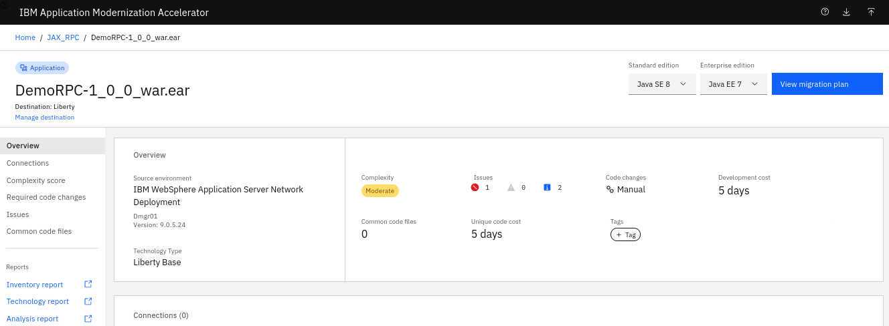</kbd>

	As you can see, there is 1 issue that needs to be fixed. The estimated development effort for that issue is 5 days.

5. Scroll down to the **Issues** section and you can see that the issue is in the unique code and requires a migration from JAX-RPC to JAX-WS.

	<kbd>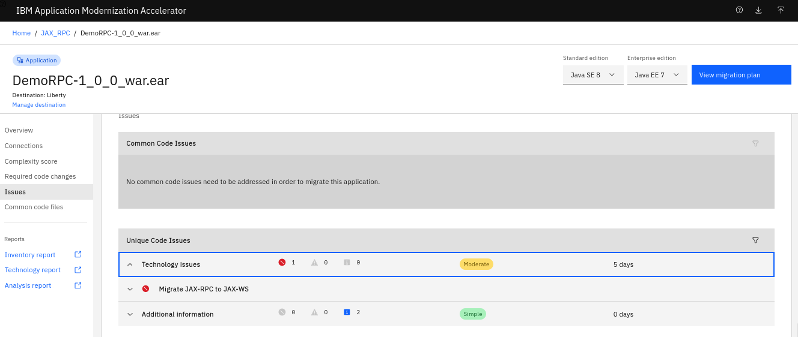</kbd>

6. Open the twisty for the issue and you can see the different migration paths to resolve the issue. You will use the first option which uses the **JAX-RPC Source Migration Helper**.

	<kbd>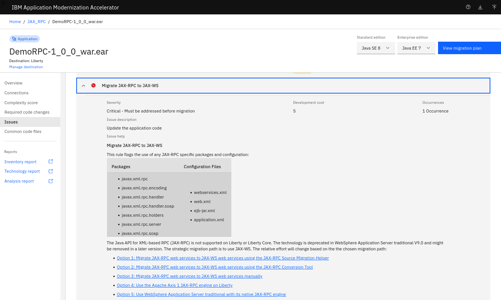</kbd>

7. Click on the blue button on the top, named **View migration plan**.

	<kbd>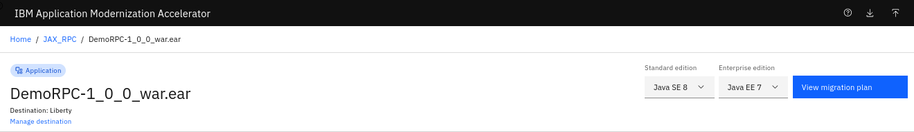</kbd>

8. The migration plan will be generated and made available for download. Click on the blue button on the button, named **Download** to download the plan.
You will use the plan later on in the AMA Developer tools.

	<kbd>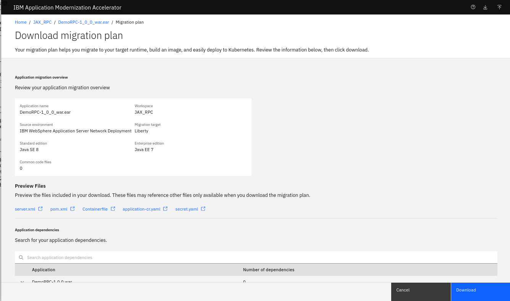</kbd>

### Assess the JAX-RPC client application

1. Click on the link **JAX-RPC** to switch back to the assessment overview.
	<kbd></kbd>

2. Click on **DemoRPCClient-1_0_0_war.ear** to see the issues for the JAX-RPC client.
	<kbd></kbd>

	As you can see, there is 1 issue that needs to be fixed. The estimated development effort for that issue is 5 days.

3. Scroll down to the **Issues** section and you can see that the issue is in the unique code and requires a migration from JAX-RPC to JAX-WS.

	<kbd>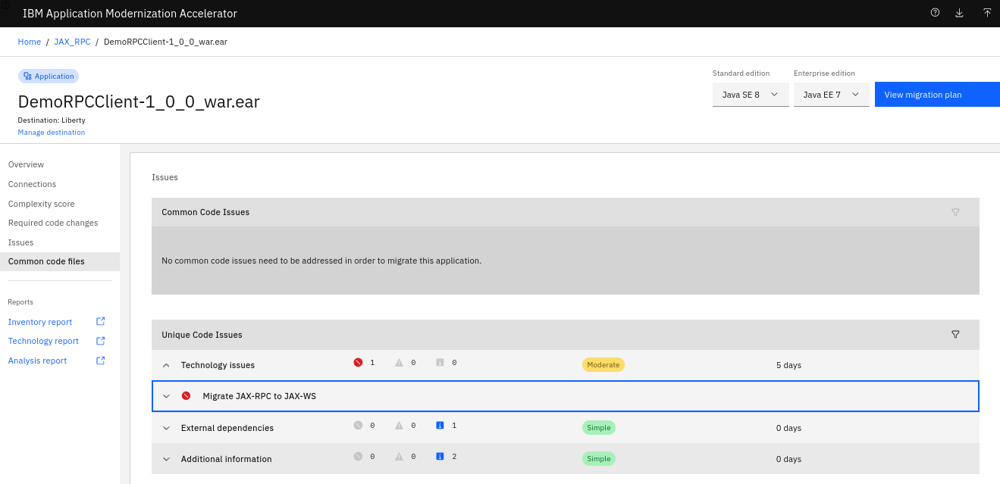</kbd>

4. Open the twisty for the issue and you can see the different migration paths to resolve the issue. You will use the first option which uses the **JAX-RPC Source Migration Helper**.

	<kbd>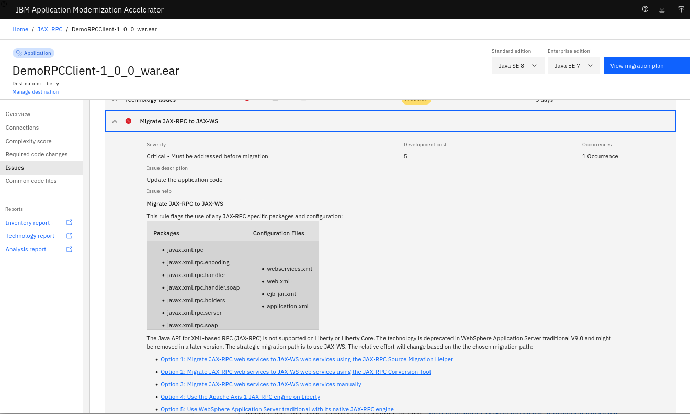</kbd>

5. Click on the blue button on the top, named **View migration plan**.

	<kbd>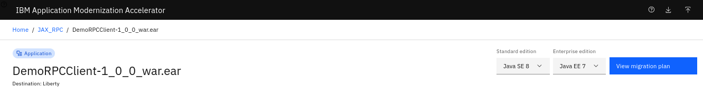</kbd>

6. The migration plan will be generated and made available for download. Click on the blue button on the button, named **Download** to download the plan.
You can use the plan later on in the AMA Developer tools.

	<kbd></kbd>

### Verify that the migration plans have been downloaded

Switch to a terminal window and execute the command

	ls ~/Downloads/Demo*

The following files shhould get listed:

- /home/techzone/Downloads/DemoRPC-1_0_0_war.ear_migrationPlan.zip
- /home/techzone/Downloads/DemoRPCClient-1_0_0_war.ear_migrationPlan.zip

 

## Modernize the JAX-RPC service application using the Application Modernization Accellerator Development Tools

1. Open a terminal und switch to the directory containing the JAX-RPC service project. 

		cd ~/Student/demo-rpc-ws-project/DemoRPC

2. Open VS Code

		code .

	Ignore any popups and close the Welcome panel.

3. In VS Code, switch to the **Project Explorer**

4. Run the modernization wizard
	1. Right-click in the project folder on the directory src and select **Modernize Java Applications > Modernize to Liberty**.

	<kbd></kbd>

	2. Click the button **Upload migration plan** 

		<kbd>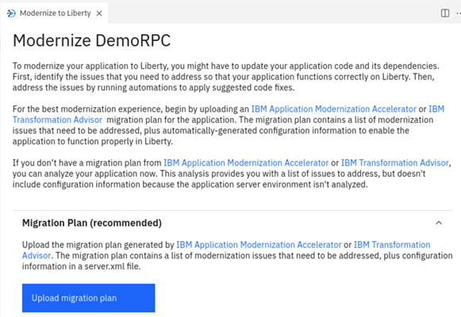</kbd>

	
	3. Select the migration plan that you exported from AMA and click on **Open**. If you followed the instructions, you can find the migration plan at: 

			/home/techzone/Downloads/DemoRPC-1_0_0_war.ear_migrationPlan.zip

		<kbd>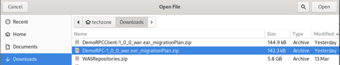</kbd>

		Hint: A backup is available under /home/techzone/Student/demo-rpc-ws-project/artifacts/MigrationPlans

	4. The migration plan is loaded and the embedded configuration files are shown. Keep the **server.xml** selected and click on **Proceed**. 
	
		<kbd>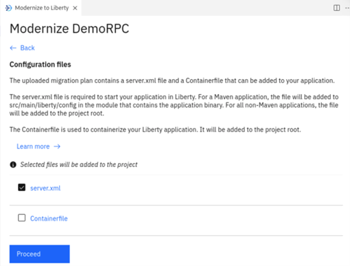</kbd>

	5. The wizard has detected that the application uses JAX-RPC. Click on **Proceed** to start the automated conversion to JAX-WS. 
	
		<kbd>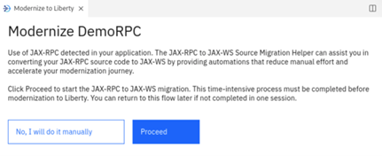</kbd>

	6. On the **JAX-RPC Source Migration Helper** panel, open the twisty for **Module: DemoRPC**.
	
		<kbd></kbd>

		Then open the twisty right to section **Pending**.
	
		<kbd></kbd>
	
	7. Click on the link with the wsld file.

		<kbd>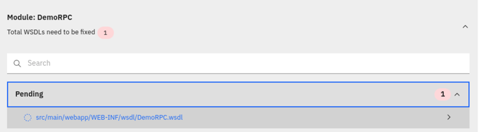</kbd>
	
	8. The next panel shows the steps that need to be performed.

		<kbd>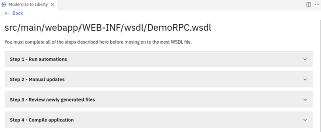</kbd>
	
	9. Open the twisty for the section **Step 1 - Run automations**, then click on the button **Run Automations**.

		<kbd>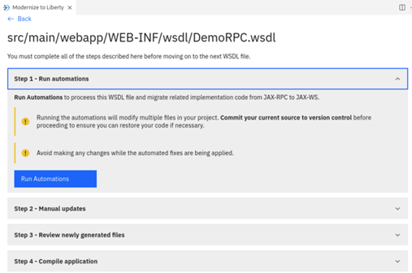</kbd>

	10. Wait until you get the feedback **Automations applied**.

		<kbd>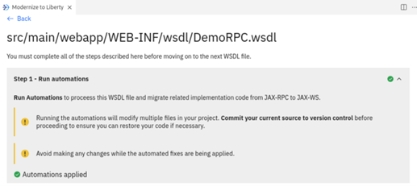</kbd>

	11. Close the twisty for **Run automations** and open the twisty for **Manual updates**.

		<kbd>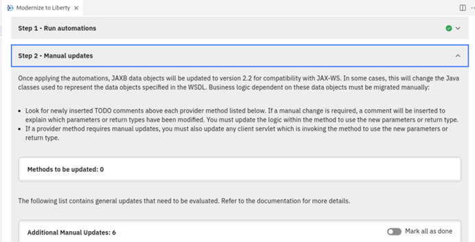</kbd>

		As you can see, there are no methods that need to be update.

	12. Scroll down to the section **Additional Manual Updates** which lists general updates that need to be evaluated.

		<kbd>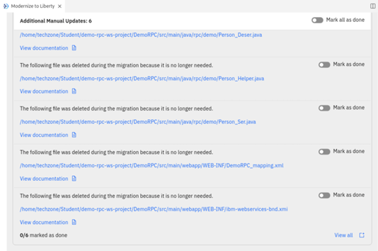</kbd>

		Review those updates, then select **Mark all as done**.

		<kbd>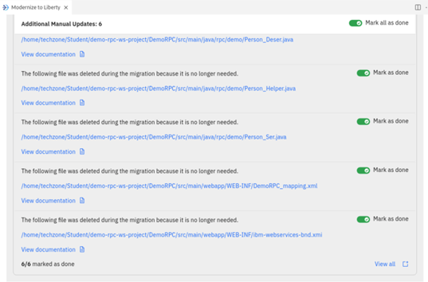</kbd>

	13. Close the section **Manual updates** and open the section **Step 3 - Review newly generated files**. 

		<kbd>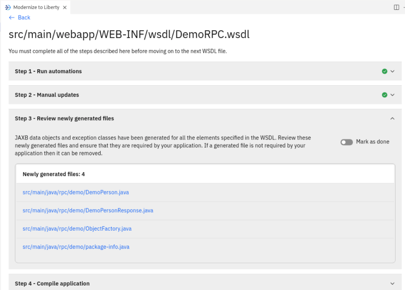</kbd>

		Feel free to review the generated files, then select **Mark as done**.

		<kbd>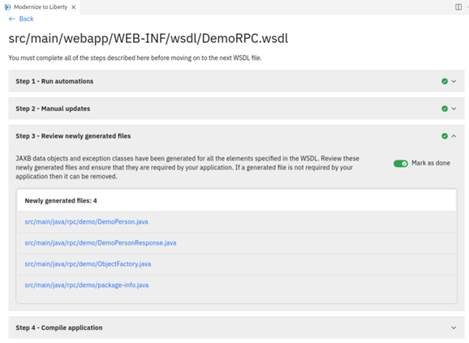</kbd>

	14. Close the section **Step 3 - Review newly generated files** and open the section **Step 4 - Compile application files**. 

		<kbd>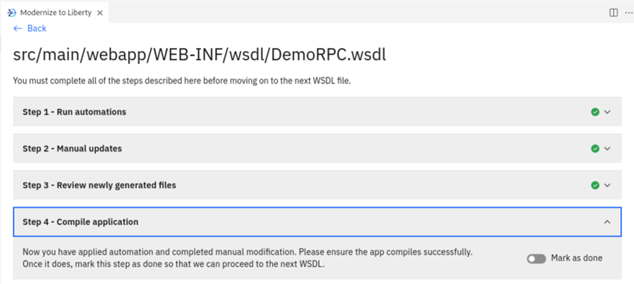</kbd>

		You will compile the application later, so just select **Mark as done**. 
		
		<kbd>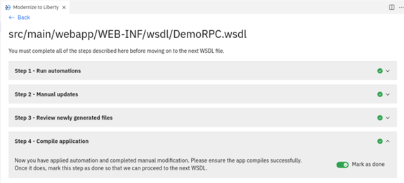</kbd>

	15. Click on the link **Back** at the top of the wizard.

		<kbd></kbd>

	16. Back on the main page, click on **Build and analyze**.
	
		<kbd>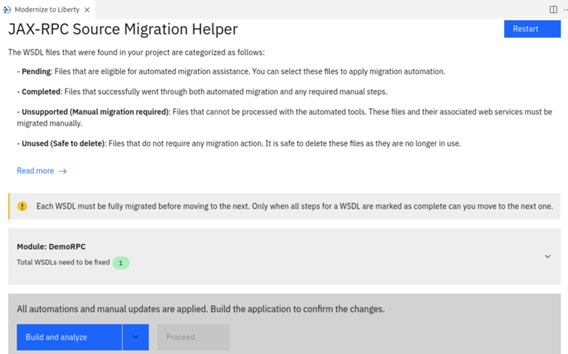</kbd>

	17. Make sure that the build is successful.

		<kbd>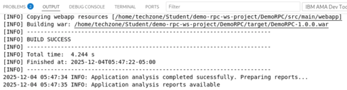</kbd>

		Then click on **Proceed**.

		<kbd>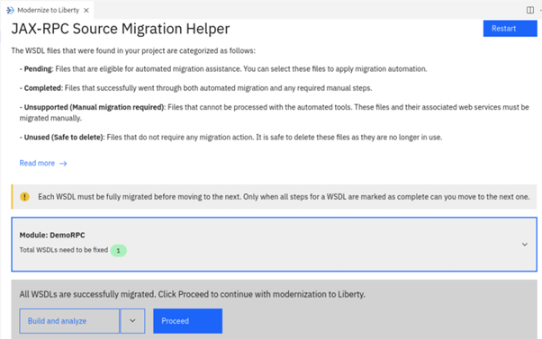</kbd>

	18. The panel should indicate that there are no issues left.

		<kbd>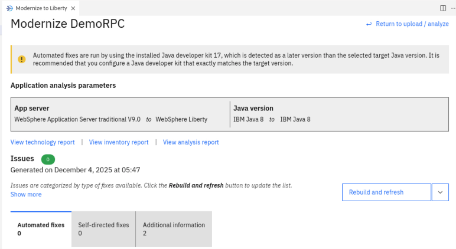</kbd>

		Close the modernization wizard.

5. Complete the manual updates required for Liberty deployment  

	1. Switch to the **VS Code Project Explorer** and open the **server.xml** file that has been imported from the migration plan. The server.xml file is located in the folder **/src/main/liberty/config**
	As you can see, the jaxws-2.2 feature is missing.

		<kbd>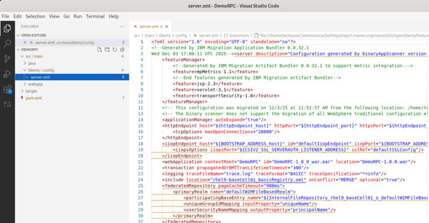</kbd>

		There are also some other settings that you do not need at the moment like the federated repository. A basic server.xml looks like this:

			<?xml version="1.0" encoding="UTF-8"?>
			<server>
    			<featureManager>
        			<feature>servlet-4.0</feature>
        			<feature>localConnector-1.0</feature>
        			<feature>jaxws-2.2</feature>
        			<feature>jsp-2.3</feature>
    			</featureManager>

    			<variable name="http.port" defaultValue="9080"/>
    			<variable name="https.port" defaultValue="9443"/>
    			<variable name="app.context.root" value="/"/>
    			<!-- tag::httpEndpoint[] -->
    			<httpEndpoint httpPort="${http.port}"
                	  httpsPort="${https.port}" id="defaultHttpEndpoint"  host="*" />
    			<!-- end::httpEndpoint[] -->
    			<webApplication id="ServletSample" location="test-project-1.0.0.war" contextRoot="${app.context.root}" />
				<!-- TODO: note for the user to set the contextRoot based on their old WSDL/url/endpoint -->
			</server>

	2. To ease the cleanup of the server.xml, replace the server.xml in the project with a preparated one:

		In VSCode, switch to the terminal and execute the command:
		
			cp  ~/Student/demo-rpc-ws-project/artifacts/DemoRPC-server.xml    ~/Student/demo-rpc-ws-project/DemoRPC/src/main/liberty/config/server.xml 

		<kbd>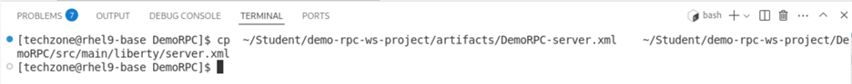</kbd>

	<!--
	3. Update the pom.xml
		
			Change to <sourceDirectory>src/main/java</sourceDirectory>
	-->

	3. Stop server1 which hosts the original JAXRPC-service.

			~/IBM/WebSphere/AppServer/profiles/AppSrv01/bin/stopServer.sh server1

	4. In VS Code – Rebuild and package the DemoRPC app by executing in the terminal window the command
			
			mvn clean package

		<kbd>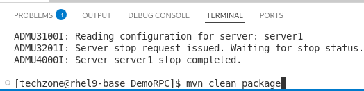</kbd>

	5. Start the Liberty instance via Liberty Dashboard
	
		<kbd>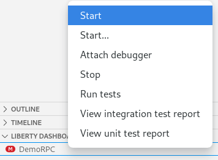</kbd>

	
	6. Access the JAX-WS service on Liberty via the URL: http://localhost:9080/DemoRPC/services/DemoRPC
	
		<kbd>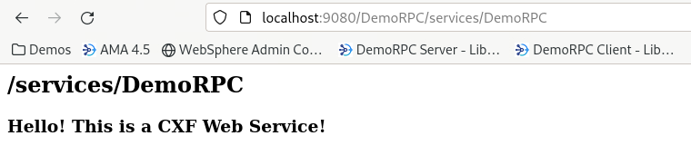</kbd>

	7. Access the JAX-RPC client hosted on tWAS server2 at URL: http://localhost:9082/DemoRPCClient

		<kbd>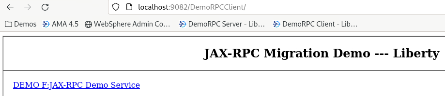</kbd>

	8. Click on the link to access the servlet page **Personal Info Web Service**

		<kbd>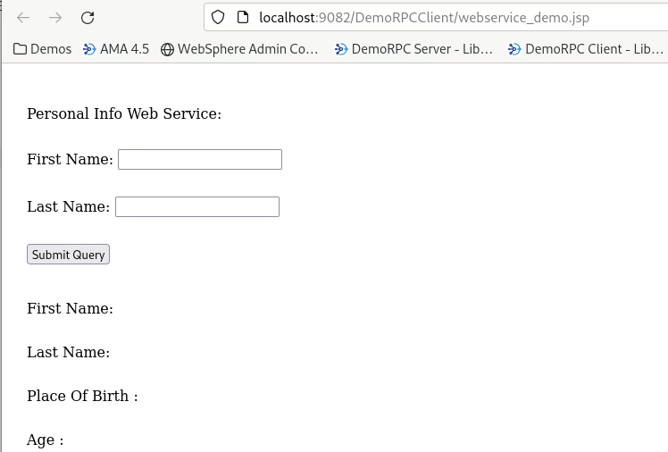</kbd>

	9. Enter John Doe as name, then click on **Submit Query** 

		<kbd>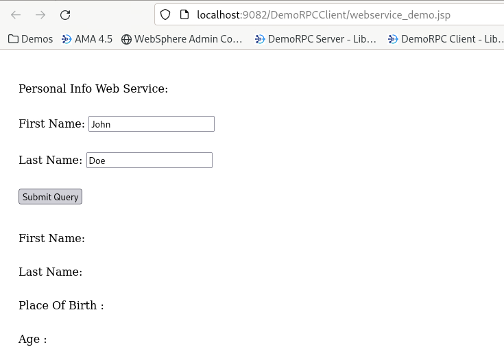</kbd>

		You should get the age and place of birth as response from the JAX-WS service. 

		<kbd>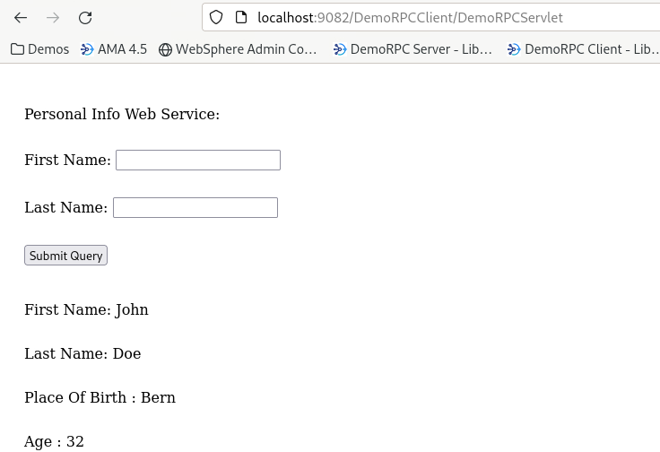</kbd>

	10. Stop the Liberty instance via Liberty Dashboard
	
		<kbd>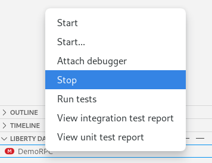</kbd>

	11. Close VS Code

	HINT: If you want to start the server again, you could do it directly via the command:
		
		~/Student/demo-rpc-ws-project/DemoRPC/target/liberty/wlp/bin/server start defaultServer

	
 SUCCESS: 

 You successfully converted a JAX-RPC service to JAX-WS so that it can run on Liberty. As you have seen, the interoperability between the JAX-RPC client running on traditional WAS and the JAX-WS service running on Liberty works.
 
The next step is now to convert the JAX-RPC client to JAX-WS, so that it can run on Liberty as well.

### Troubleshooting:

You can also find the completed project here:

	~/Student/demo-rpc-ws-project/artifacts/DemoRPC_completed.zip

To switch to the completed project, use the commands:

		cd ~/Student/demo-rpc-ws-project
		mv DemoRPC DemoRPC.ori
		unzip artifacts/DemoRPC_completed.zip 

To start the JAX-WS service in dev mode without Liberty dashboard, you can use the following commands:

	cd ~/Student/demo-rpc-ws-project/DemoRPC/
	mvn io.openliberty.tools:liberty-maven-plugin:dev -f pom.xml

 

## Modernize the JAX-RPC client application using the Application Modernization Accellerator Development Tools

For the conversion of the JAX-RPC client to JAX-WS the same steps as for the service are required. Based on this, there are two options:

- Fast path: Use the already migrated client and test it on Liberty
- Detailed path: Use AMA with the migration plan and do the required steps 

### Preparation
Make sure that the environment is running:
- The traditional WAS server2 is running with the JAX-RPC client
- The Liberty server is running with the JAX-WS service

1. Test the client and service

	1. Access the JAX-WS service on Liberty via the URL: http://localhost:9080/DemoRPC/services/DemoRPC
	
		<kbd></kbd>

		HINT: If the Liberty server hosting the JAX-WS service is not started, use the command:
		
			~/Student/demo-rpc-ws-project/DemoRPC/target/liberty/wlp/bin/server start defaultServer

	2. Access the JAX-RPC client hosted on tWAS server2 at URL: http://localhost:9082/DemoRPCClient 

		<kbd></kbd>

		HINT: If the tWAS instance hosting the JAX-RPC client is not started, use the command:
		
			~/IBM/WebSphere/AppServer/profiles/AppSrv02/bin/startServer.sh server2

	3. Click on the link to access the servlet page **Personal Info Web Service**, enter the name and click on SubmitQuery.

		<kbd></kbd>

		Verify that the service works.

3. Open a terminal window and stop the server hosting the JAXRPC-client.

		~/IBM/WebSphere/AppServer/profiles/AppSrv02/bin/stopServer.sh server2

### Fast path: Use the already migrated client and test it on Liberty
As the steps for the conversion of the JAX-RPC-CLient are the same as for the JAX-RPC service, an already updated project has been provided. You can use that project to just test the end-2-end scenario JAX-WS client to JAX-WS service, both running on Liberty.

1. Copy the already converted client project

		cp -r ~/Student/demo-rpc-ws-project/DemoRPCClient.Modernized/DemoRPCClient* ~/Student/demo-rpc-ws-project

2. Switch to the client project and review the project.

	1. Open the project in VS Code

			cd ~/Student/demo-rpc-ws-project/DemoRPCClient
			code .

	2. Review the **server.xml** file

		<kbd>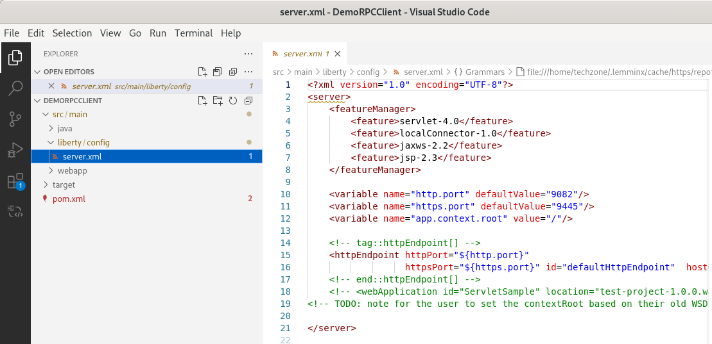</kbd>

		
3. Test the converted client

	1. Start the Liberty server via **Liberty dashboard** 

		<kbd>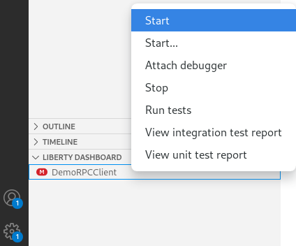</kbd>
	2. Access the JAX-WS client hosted on Liberty at URL: http://localhost:9082/DemoRPCClient-1.0.0 

		<kbd>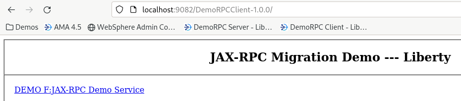</kbd>

	3. Click on the link to access the servlet page **Personal Info Web Service**, enter the name and click on SubmitQuery.

		<kbd>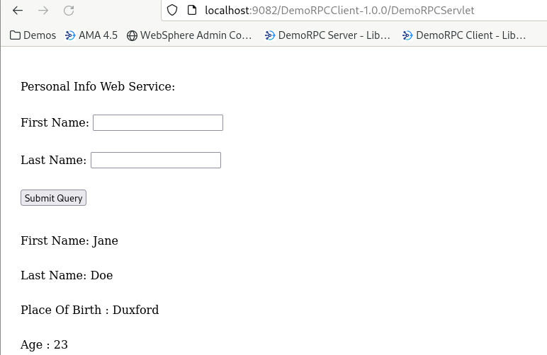</kbd>

	4. Review the logs of the Liberty server hosting the JAX-WS service 

		tail -n 9 ~/Student/demo-rpc-ws-project/DemoRPC/target/liberty/wlp/usr/servers/defaultServer/logs/messages.log

		You should find entries indicating that the service has been called by the client **DemoRPCClient-1.0.0** for the person **Jane Doe**

		<kbd>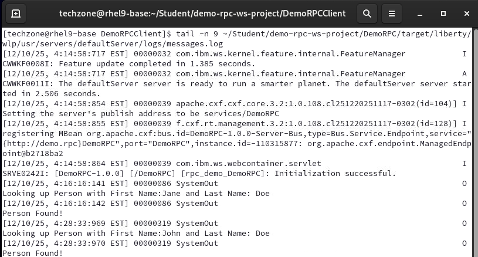</kbd>

	5. Review the logs of the Liberty server hosting the JAX-WS client 

		tail -n 6 ~/Student/demo-rpc-ws-project/DemoRPCClient/target/liberty/wlp/usr/servers/defaultServer/logs/messages.log 

		You should find entries indicating that the client **DemoRPCClient-1.0.0** initialized the servlet **DemoRPCServlet**.

		<kbd>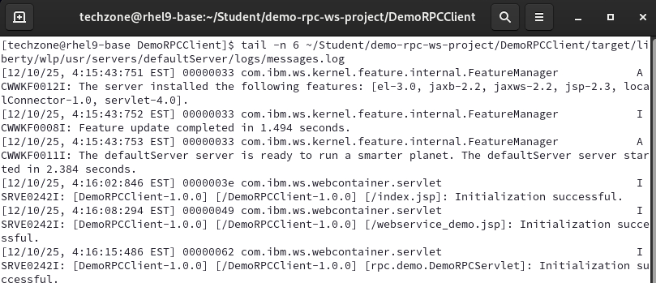</kbd>

4. Test the converted client with the original JAX-RPC service running on tWAS.

	1. Stop the Liberty server hosting the JAX-WS service

			~/Student/demo-rpc-ws-project/DemoRPC/target/liberty/wlp/bin/server stop defaultServer

	2. Test that the aceess from the JAX-WS client to the JAX-WS service fails.

		<kbd></kbd>

	3. Start server1 which hosts the original JAXRPC-service.

			~/IBM/WebSphere/AppServer/profiles/AppSrv01/bin/startServer.sh server1

	4. Test the access from the JAX-WS client hosted on Liberty to the JAX-RPC service hosted on traditional WAS using the name **John Doe**

	5. Review the logs of the tWAS server hosting the JAX-RPC service 

			tail -n 9 /home/techzone/IBM/WebSphere/AppServer/profiles/AppSrv01/logs/server1/SystemOut.log

		You should find an entry indicating that the service has been called for the person **John Doe**

		<kbd>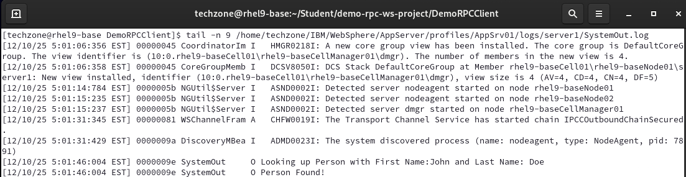</kbd>

5. Clean up:

	1. Stop server1 which hosts the original JAXRPC-service.

			~/IBM/WebSphere/AppServer/profiles/AppSrv01/bin/stopServer.sh server1
	
	2. Stop the Liberty server hosting the client
	
		Switch to VC Code and use the Liberty dashboard to stop the server.
	
	3. Close VS Code.
	
	4. Stop the WAS ND Deployment Manager and the two node agents
	
			~/Student/demo-rpc-ws-project/scripts/stopWASEnv.sh

		Alternatively you could also start the components separately

			~/IBM/WebSphere/AppServer/profiles/AppSrv01/bin/stopNode.sh 
			~/IBM/WebSphere/AppServer/profiles/AppSrv02/bin/stopNode.sh 
			~/IBM/WebSphere/AppServer/profiles/Dmgr01/bin/stopManager.sh
		
	5. Remove the project directory

			rm -rf ~/Student

SUCCESS: 

 - The converted JAX-WS client can call the converted JAX-WS service, both running on Liberty. 
 - The converted JAX-WS client can also call the original JAX-RPC service, where the client runs on Liberty and the service on traditional WAS. 

 This concludes the fastpath section for the JAX-RPC client conversion.
 If you are interested how the updated client was generated, take a look at the next section.

 ### Detailed path: Use AMA with the migration plan and do the required steps 

 As the steps for the conversion of the JAX-RPC-CLient are the same as for the JAX-RPC service, an already updated project has been provided. You can use that project to just test the end-2-end scenario JAX-WS client to JAX-WS service, both running on Liberty.

1. Copy the already converted client project

		cp -r ~/Student/demo-rpc-ws-project/DemoRPCClient.Original/DemoRPCClient* ~/Student/demo-rpc-ws-project

2. Switch to the client project and open the project in VS Code

		cd ~/Student/demo-rpc-ws-project/DemoRPCClient
		code .

	Ignore any popups and close the Welcome panel.

3. In VS Code, switch to the **Project Explorer**

4. Run the modernization wizard
	1. Right-click in the project folder on the directory src and select **Modernize Java Applications > Modernize to Liberty**.

		<kbd>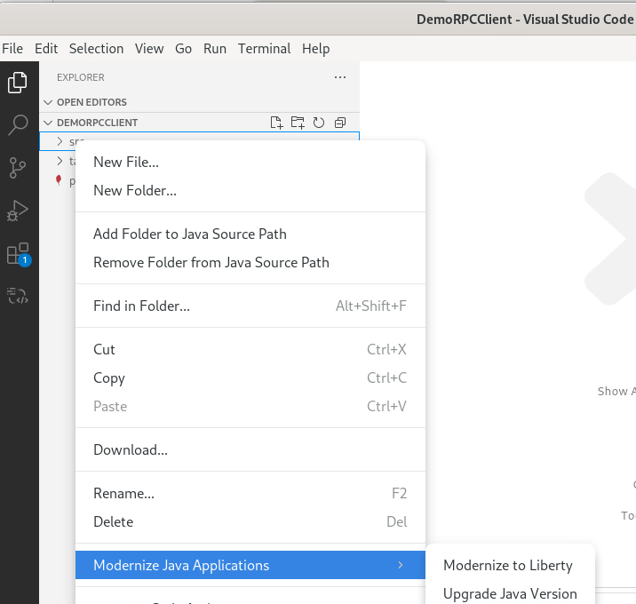</kbd>

	2. Click the button **Upload migration plan**.

		<kbd>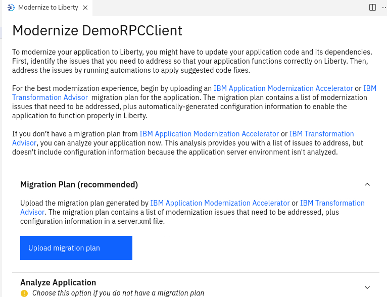</kbd>

	
	3. Select the migration plan that you exported from AMA and click on **Open**. If you followed the instructions, you can find the migration plan at: 

			/home/techzone/Downloads/DemoRPCClient-1_0_0_war.ear_migrationPlan.zip

		<kbd>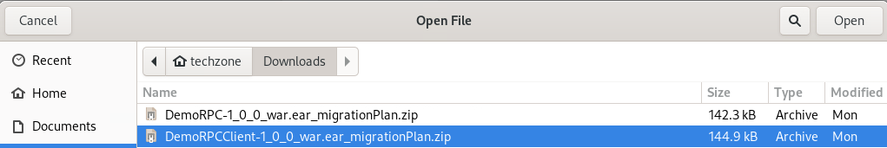</kbd>

		Hint: A backup is available under /home/techzone/Student/
		demo-rpc-ws-project/artifacts/MigrationPlans

	4. The migration plan is loaded and the embedded configuration files are shown. Keep the **server.xml** selected and click on **Proceed**. 
	
		<kbd>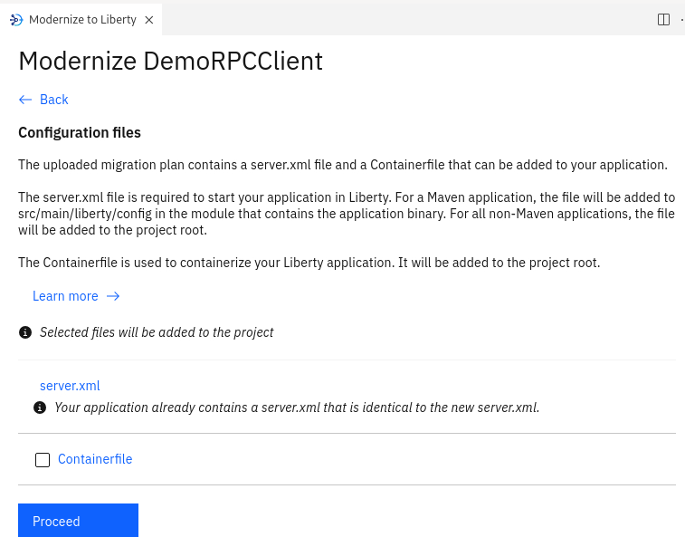</kbd>

	5. The wizard has detected that the application uses JAX-RPC. Click on **Proceed** to start the automated conversion to JAX-WS. 
	
		<kbd>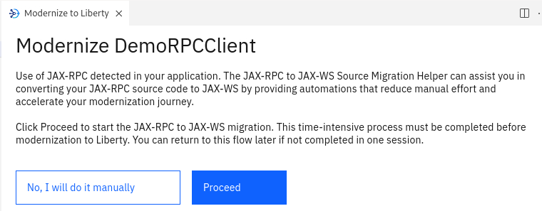</kbd>

	6. On the **JAX-RPC Source Migration Helper** panel, open the twisty for **Module: DemoRPCClient** (if not already open). 
	
		Then open the twisty right to section **Pending**  (if not already open).
	
		<kbd>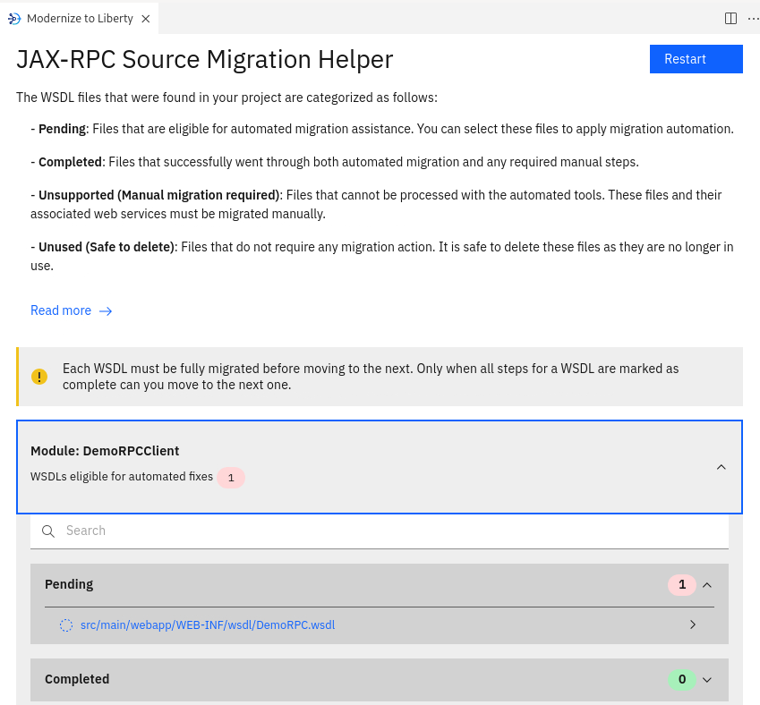</kbd>

	7. Click on the link with the wsld file.

		<kbd>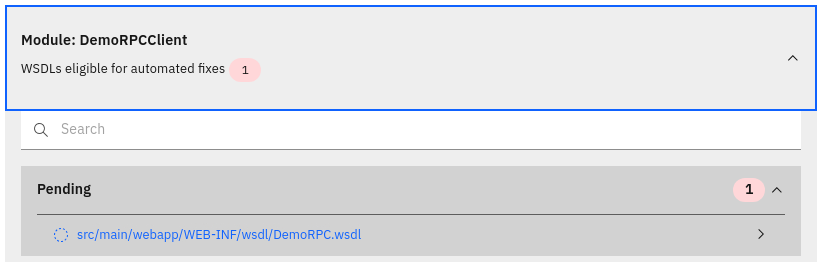</kbd>
	

	8. The next panel shows the steps that need to be performed.

		<kbd>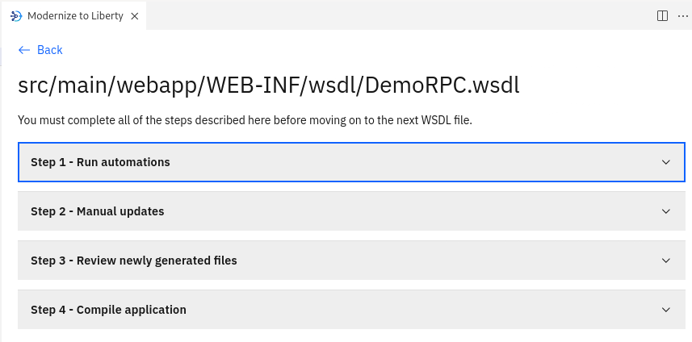</kbd>
	

	9. Open the twisty for the section **Step 1 - Run automations**, then click on the button **Run Automations**.

		<kbd>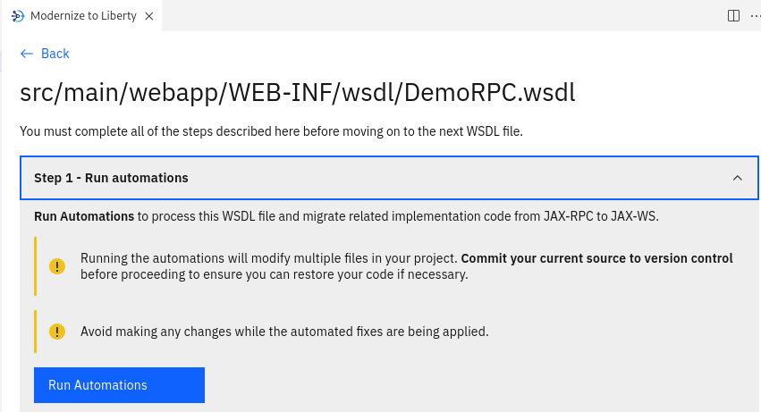</kbd>

	10. Wait until you get the feedback **Automations applied**.

		<kbd>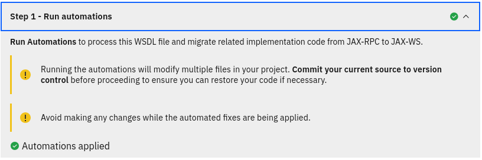</kbd>

	11. Close the twisty for **Run automations** and open the twisty for **Manual updates**.

		<kbd>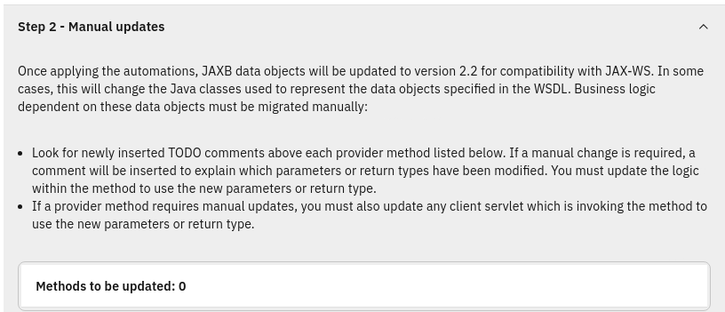</kbd>

		As you can see, there are no methods that need to be update.

	12. Scroll down to the section **Additional Manual Updates** which lists general updates that need to be evaluated.

		<kbd>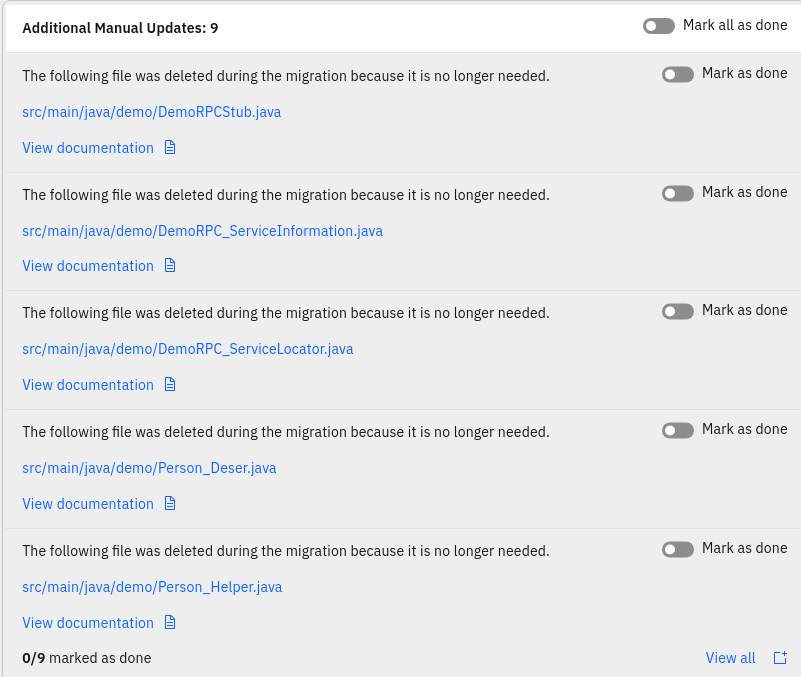</kbd>

		Review those updates, then select **Mark all as done**.

		<kbd></kbd>

	13. Close the section **Manual updates** and open the section **Step 3 - Review newly generated files**. 

		<kbd>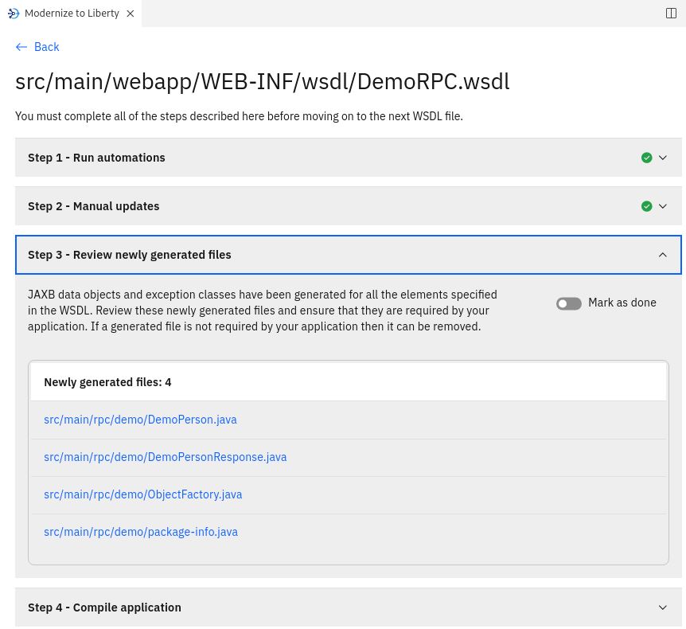</kbd>

		Feel free to review the generated files, then select **Mark as done**.

		<kbd>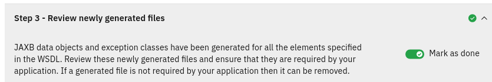</kbd>

	14. Close the section **Step 3 - Review newly generated files** and open the section **Step 4 - Compile application files**. 

		
		You will compile the application later, so just select **Mark as done**. 
		
		<kbd>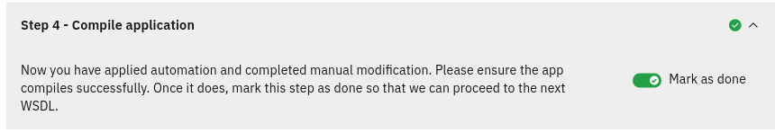</kbd>

	15. Click on the link **Back** at the top of the wizard.

		<kbd>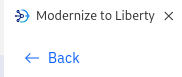</kbd>

	16. Back on the main page, click on **Build and analyze**.
	
		<kbd>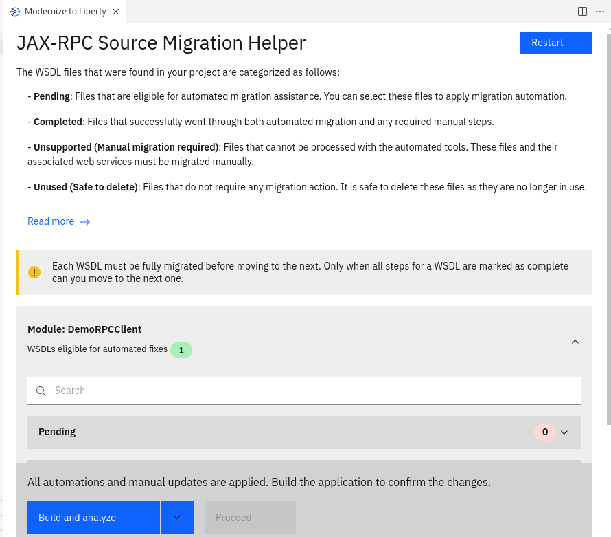</kbd>

	17. Make sure that the build is successful.

		<kbd>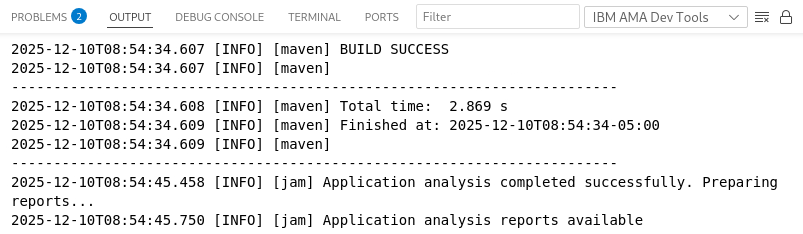</kbd>

		Then click on **Proceed**.

	18. The panel should indicate that there are no issues left.

		<kbd>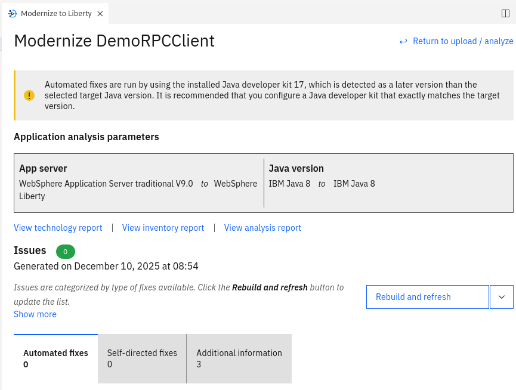</kbd>

		Close the modernization wizard.

5. Complete the manual updates required for Liberty deployment  

	1. Switch to the **VS Code Project Explorer** and open the **server.xml** file that has been imported from the migration plan. The server.xml file is located in the folder **/src/main/liberty/config**
	As you can see, the jaxws-2.2 feature is missing.

		<kbd>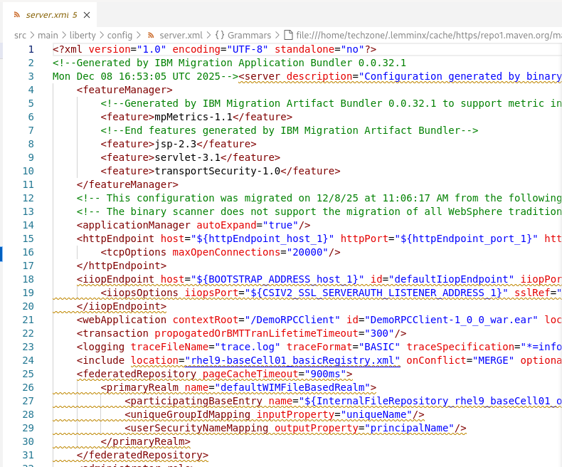</kbd>

		There are also some other settings that you do not need at the moment like the federated repository. A basic server.xml looks like this:

			<?xml version="1.0" encoding="UTF-8"?>
			<server>
    			<featureManager>
        			<feature>servlet-4.0</feature>
        			<feature>localConnector-1.0</feature>
        			<feature>jaxws-2.2</feature>
        			<feature>jsp-2.3</feature>
    			</featureManager>

    			<variable name="http.port" defaultValue="9082"/>
    			<variable name="https.port" defaultValue="9445"/>
    			<variable name="app.context.root" value="/"/>

    			<!-- tag::httpEndpoint[] -->
    			<httpEndpoint httpPort="${http.port}"
                		  httpsPort="${https.port}" id="defaultHttpEndpoint"  host="*" />
    			<!-- end::httpEndpoint[] -->
    			<!-- <webApplication id="ServletSample" location="test-project-1.0.0.war" contextRoot="${app.context.root}" /> -->
				<!-- TODO: note for the user to set the contextRoot based on their old WSDL/url/endpoint -->
			</server>

	2. To ease the cleanup of the server.xml, replace the server.xml in the project with a preparated one:

		In VSCode, switch to the terminal and execute the command:
		
			cp  ~/Student/demo-rpc-ws-project/artifacts/DemoRPCClient-server.xml ~/Student/demo-rpc-ws-project/DemoRPCClient/src/main/liberty/config/server.xml 

		<kbd>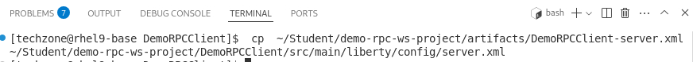</kbd>

	3. In VS Code – Rebuild and package the DemoRPC app by executing in the terminal window the command
			
			mvn clean package

		<kbd></kbd>

6. Test the converted client

	1. Start the Liberty server via **Liberty dashboard** 

		<kbd>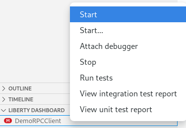</kbd>

	2. Access the JAX-WS client hosted on Liberty at URL: http://localhost:9082/DemoRPCClient-1.0.0 

		<kbd>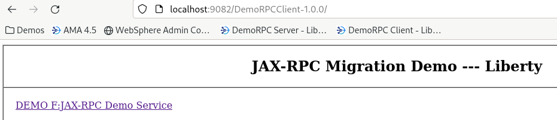</kbd>

	3. Click on the link to access the servlet page **Personal Info Web Service**, enter the name and click on SubmitQuery.

		<kbd>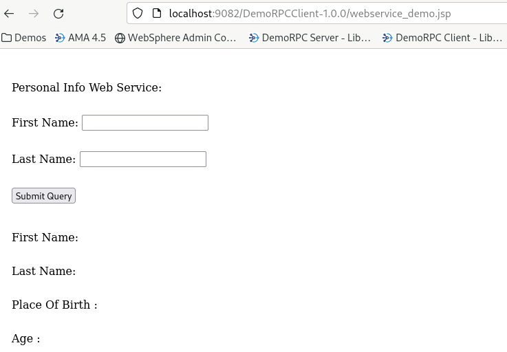</kbd>
		
	4. Review the logs of the Liberty server hosting the JAX-WS service 

			tail -n 9 ~/Student/demo-rpc-ws-project/DemoRPC/target/liberty/wlp/usr/servers/defaultServer/logs/messages.log

		You should find entries indicating that the service has been called by the client **DemoRPCClient-1.0.0** for the person **Jane Doe**

		<kbd>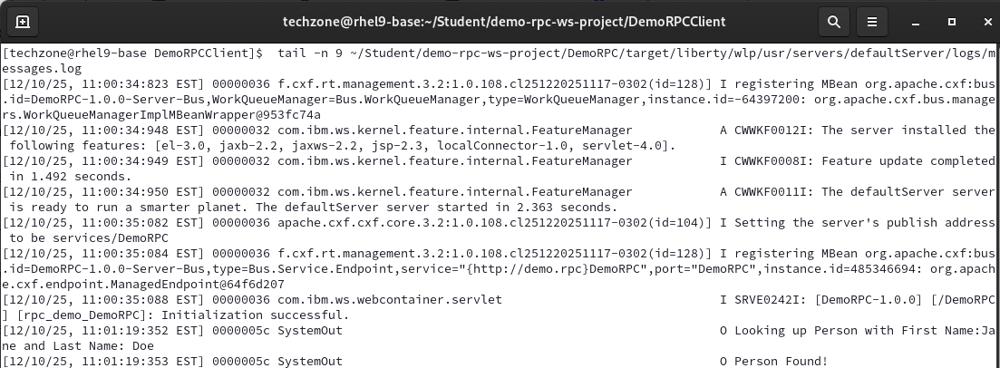</kbd>

	5. Review the logs of the Liberty server hosting the JAX-WS client 

			tail -n 6 ~/Student/demo-rpc-ws-project/DemoRPCClient/target/liberty/wlp/usr/servers/defaultServer/logs/messages.log 

		You should find entries indicating that the client **DemoRPCClient-1.0.0** initialized the servlet **DemoRPCServlet**.

		<kbd></kbd>

**** Work in progress ***

4. Test the converted client with the original JAX-RPC service running on tWAS.

	1. Stop the Liberty server hosting the JAX-WS service

			~/Student/demo-rpc-ws-project/DemoRPC/target/liberty/wlp/bin/server stop defaultServer

	2. Test that the aceess from the JAX-WS client to the JAX-WS service fails.

		<kbd></kbd>

	3. Start server1 which hosts the original JAXRPC-service.

			~/IBM/WebSphere/AppServer/profiles/AppSrv01/bin/startServer.sh server1

	4. Test the access from the JAX-WS client hosted on Liberty to the JAX-RPC service hosted on traditional WAS using the name **John Doe**

	5. Review the logs of the tWAS server hosting the JAX-RPC service 

			tail -n 9 /home/techzone/IBM/WebSphere/AppServer/profiles/AppSrv01/logs/server1/SystemOut.log

		You should find an entry indicating that the service has been called for the person **John Doe**

		<kbd></kbd>

5. Clean up:

	1. Stop server1 which hosts the original JAXRPC-service.

			~/IBM/WebSphere/AppServer/profiles/AppSrv01/bin/stopServer.sh server1
	
	2. Stop the Liberty server hosting the client
	
		Switch to VC Code and use the Liberty dashboard to stop the server.
	
	3. Close VS Code.
	
	4. Stop the WAS ND Deployment Manager and the two node agents
	
			~/Student/demo-rpc-ws-project/scripts/stopWASEnv.sh

		Alternatively you could also start the components separately

			~/IBM/WebSphere/AppServer/profiles/AppSrv01/bin/stopNode.sh 
			~/IBM/WebSphere/AppServer/profiles/AppSrv02/bin/stopNode.sh 
			~/IBM/WebSphere/AppServer/profiles/Dmgr01/bin/stopManager.sh
		
	5. Remove the project directory

			rm -rf ~/Student

SUCCESS: 

	6. Access the JAX-WS service on Liberty via the URL: http://localhost:9080/DemoRPC/services/DemoRPC
	
		<kbd></kbd>

	7. Access the JAX-RPC client hosted on tWAS server2 at URL: http://localhost:9082/DemoRPCClient

		<kbd></kbd>

	8. Click on the link to access the servlet page **Personal Info Web Service**

		<kbd></kbd>

	9. Enter John Doe as name, then click on **Submit Query** 

		<kbd></kbd>

		You should get the age and place of birth as response from the JAX-WS service. 

		<kbd></kbd>

	10. Stop the Liberty instance via Liberty Dashboard
	
		<kbd></kbd>

	11. Close VS Code

	HINT: If you want to start the server again, you could do it directly via the command:
		
		~/Student/demo-rpc-ws-project/DemoRPC/target/liberty/wlp/bin/server start defaultServer

	
 SUCCESS: 

 You successfully converted a JAX-RPC service to JAX-WS so that it can run on Liberty. As you have seen, the interoperability between the JAX-RPC client running on traditional WAS and the JAX-WS service running on Liberty works.
 
The next step is now to convert the JAX-RPC client to JAX-WS, so that it can run on Liberty as well.

	2. Review the **server.xml** file

		<kbd></kbd>

	3. Start the Liberty server via **Liberty dashboard** 

		<kbd></kbd>
		
3. Test the converted client

	1. Start the Liberty server via **Liberty dashboard** 

		<kbd></kbd>
	2. Access the JAX-WS client hosted on Liberty at URL: http://localhost:9082/DemoRPCClient-1.0.0 

		<kbd></kbd>

	3. Click on the link to access the servlet page **Personal Info Web Service**, enter the name and click on SubmitQuery.

		<kbd></kbd>

	4. Review the logs of the Liberty server hosting the JAX-WS service 

		tail -n 9 ~/Student/demo-rpc-ws-project/DemoRPC/target/liberty/wlp/usr/servers/defaultServer/logs/messages.log

		You should find entries indicating that the service has been called by the client **DemoRPCClient-1.0.0** for the person **Jane Doe**

		<kbd></kbd>

	5. Review the logs of the Liberty server hosting the JAX-WS client 

		tail -n 6 ~/Student/demo-rpc-ws-project/DemoRPCClient/target/liberty/wlp/usr/servers/defaultServer/logs/messages.log 

		You should find entries indicating that the client **DemoRPCClient-1.0.0** initialized the servlet **DemoRPCServlet**.

		<kbd></kbd>

4. Test the converted client with the original JAX-RPC service running on tWAS.

	1. Stop the Liberty server hosting the JAX-WS service

			~/Student/demo-rpc-ws-project/DemoRPC/target/liberty/wlp/bin/server stop defaultServer

	2. Test that the aceess from the JAX-WS client to the JAX-WS service fails.

		<kbd></kbd>

	3. Start server1 which hosts the original JAXRPC-service.

			~/IBM/WebSphere/AppServer/profiles/AppSrv01/bin/startServer.sh server1

	4. Test the access from the JAX-WS client hosted on Liberty to the JAX-RPC service hosted on traditional WAS using the name **John Doe**

	5. Review the logs of the tWAS server hosting the JAX-RPC service 

			tail -n 9 /home/techzone/IBM/WebSphere/AppServer/profiles/AppSrv01/logs/server1/SystemOut.log

		You should find an entry indicating that the service has been called for the person **John Doe**

		<kbd></kbd>

5. Clean up:

	1. Stop server1 which hosts the original JAXRPC-service.

			~/IBM/WebSphere/AppServer/profiles/AppSrv01/bin/stopServer.sh server1
	
	2. Stop the Liberty server hosting the client
	
		Switch to VC Code and use the Liberty dashboard to stop the server.
	
	3. Close VS Code.
	
	4. Stop the WAS ND Deployment Manager and the two node agents
	
			~/Student/demo-rpc-ws-project/scripts/stopWASEnv.sh

		Alternatively you could also start the components separately

			~/IBM/WebSphere/AppServer/profiles/AppSrv01/bin/stopNode.sh 
			~/IBM/WebSphere/AppServer/profiles/AppSrv02/bin/stopNode.sh 
			~/IBM/WebSphere/AppServer/profiles/Dmgr01/bin/stopManager.sh
		
	5. Remove the project directory

			rm -rf ~/Student

SUCCESS: 

 - The converted JAX-WS client can call the converted JAX-WS service, both running on Liberty. 
 - The converted JAX-WS client can also call the original JAX-RPC service, where the client runs on Liberty and the service on traditional WAS. 

 This concludes the detailed path section for the JAX-RPC client conversion.

